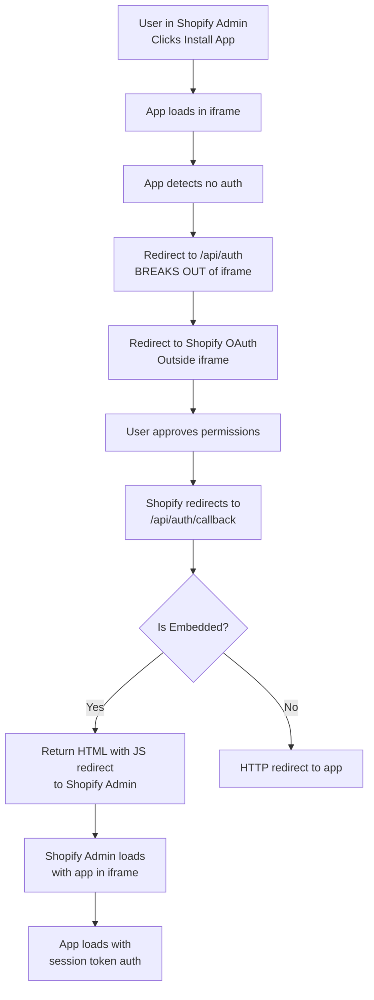

# OAuth Redirect Flow for Shopify Embedded Apps

## The Challenge with Embedded App OAuth Redirects

When building a Shopify embedded app, the OAuth flow presents a unique challenge because:
1. The OAuth authorization happens **outside** the Shopify admin iframe
2. After authorization, we need to get back **inside** the Shopify admin iframe
3. Simple HTTP redirects don't work properly for this flow

## OAuth Flow Steps for Embedded Apps



## Implementation Details

### 1. Starting OAuth (Breaking Out of iframe)
**File:** `/app/api/auth/route.ts`

When embedded app starts OAuth, it must break out of the iframe:
```javascript
if (embedded === '1') {
  const html = `
    <script>
      // Break out of iframe and redirect in parent window
      if (window.top !== window.self) {
        window.top.location.href = '${authUrl}';
      } else {
        window.location.href = '${authUrl}';
      }
    </script>
  `;
  return new NextResponse(html, { headers: { 'Content-Type': 'text/html' } });
}
```

### 2. OAuth Callback Redirect
**File:** `/app/api/auth/callback/route.ts`

After successful OAuth, we need to redirect back into the Shopify admin:

```javascript
// For embedded apps, redirect to Shopify admin which will load our app
const embeddedUrl = `https://${shop}/admin/apps/${SHOPIFY_API_KEY}`;

const redirectHtml = `
  <!DOCTYPE html>
  <html>
    <head>
      <title>Redirecting to app...</title>
    </head>
    <body>
      <p>Authentication successful! Redirecting...</p>
      <script>
        const host = '${host}';

        if (host) {
          // Embedded app - redirect to Shopify admin
          window.location.href = 'https://${shop}/admin/apps/${apiKey}';
        } else {
          // Standalone app - redirect directly
          window.location.href = '${appUrl}?shop=${shop}';
        }
      </script>
    </body>
  </html>
`;

return new NextResponse(redirectHtml, {
  headers: { 'Content-Type': 'text/html' }
});
```

## Why This Approach?

### ❌ What Doesn't Work:
1. **Simple HTTP Redirect:** `NextResponse.redirect(url)`
   - This tries to redirect the OAuth callback page directly
   - But we're outside the iframe at this point
   - The app won't load properly in Shopify admin

2. **Direct App URL:** Redirecting to `https://yourapp.com?shop=...`
   - This loads your app standalone, not embedded
   - Loses the Shopify admin context
   - No access to App Bridge features

### ✅ What Works:
1. **Redirect to Shopify Admin:** `https://{shop}/admin/apps/{api_key}`
   - Shopify admin loads with proper context
   - Your app loads in iframe automatically
   - App Bridge is available
   - Session tokens work properly

## Key Points for Embedded Apps

1. **Host Parameter:** The `host` parameter indicates embedded context
2. **API Key in URL:** Use your app's API key in the admin URL
3. **JavaScript Redirect:** Use client-side JS for the redirect
4. **Fallback:** Include noscript fallback for compatibility

## Testing the Flow

### Development:
```bash
1. Install app from Partners dashboard or direct link
2. App starts OAuth flow (breaks out of iframe)
3. Approve permissions on Shopify OAuth page
4. Redirected to: https://your-shop.myshopify.com/admin/apps/YOUR_API_KEY
5. App loads embedded with session token auth
```

### Production:
Same flow, but ensure:
- `NEXT_PUBLIC_HOST` is set to production URL
- `SHOPIFY_API_KEY` is correct for production
- SSL certificates are valid

## Common Issues & Solutions

| Issue | Cause | Solution |
|-------|-------|----------|
| App loads outside admin | Wrong redirect URL | Redirect to `/admin/apps/{api_key}` |
| "App not found" error | Wrong API key | Verify SHOPIFY_API_KEY |
| Infinite redirect loop | Session not stored | Check database write |
| Blank page after OAuth | JavaScript disabled | Add noscript fallback |
| App Bridge not available | Not embedded properly | Check host parameter |

## Session Token Authentication After OAuth

Once redirected back to Shopify admin:
1. App loads in iframe with `shop` and `host` parameters
2. App Bridge initializes and provides session tokens
3. All API calls use session token authentication
4. No need to pass access token to frontend

## Summary

✅ **Correct OAuth redirect for embedded apps:**
- Returns HTML with JavaScript redirect
- Redirects to Shopify admin URL (`/admin/apps/{api_key}`)
- Shopify handles loading your app in iframe
- App Bridge and session tokens available

❌ **Incorrect approaches:**
- Simple HTTP redirect to app URL
- Trying to stay in iframe during OAuth
- Loading app outside Shopify admin

This implementation ensures proper OAuth flow for Shopify embedded apps with seamless user experience.